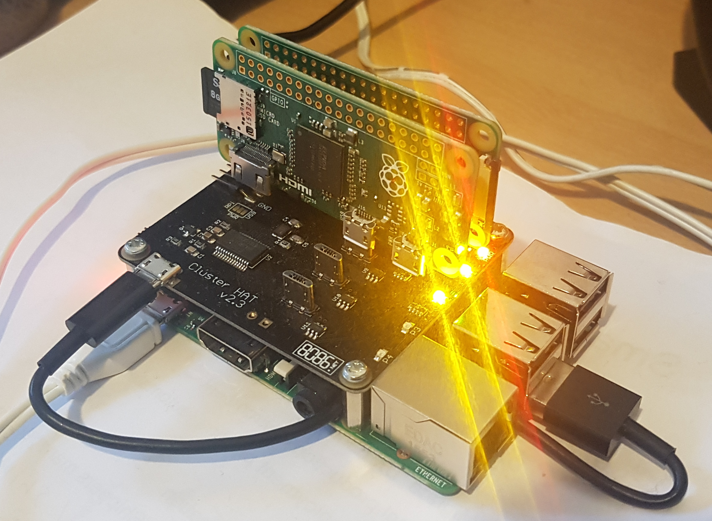
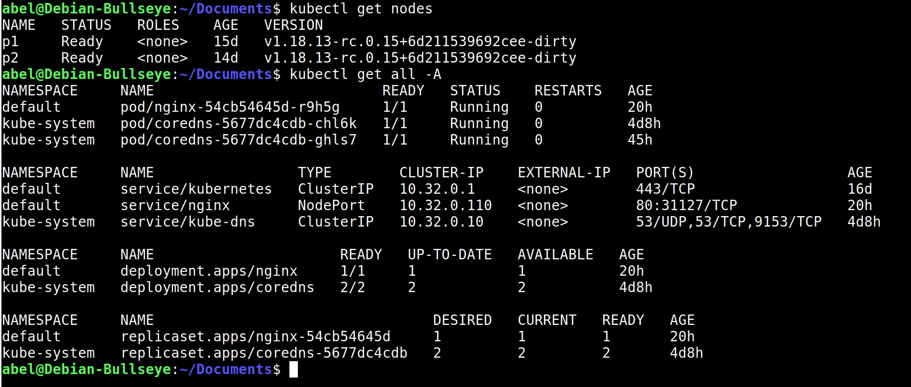

# How to install Kubernetes from scratch using Raspberry Pi and ClusterHAT 

This is a learning exercise on how to install Kubernetes from scratch on Raspberry Pi 3 (master) and Zeros (workers). 

In this guide I'll walk you through the famous guide [Kubernetes The Hard Way](https://github.com/kelseyhightower/kubernetes-the-hard-way) created by [Kelsey Hightower](https://github.com/kelseyhightower) I like to call this guide: the very very hard way. 

The final result should look like this:

## Prerequisites

* Basic understanding on Linux command line (Debian/Raspbian is recommended)
* Basic knowledge of Linux networking (general networking)
* Basic understanding on containers (no docker is required)
* Local Wi-fi or a free Ethernet port connection 
* Lots of patience - you'll need it! 

## Content

- [Introduction - Setting Up the Cluster](00-Intro.md)
- [Part 1 - Provision PKI Infrastructure](01-PKI.md)
- [Part 2 - Build Binaries From Source Code](02-Build-Binaries.md)
- [Part 3 - Prepare Configuration Files](03-Prepare-Config.md)
- [Part 4 - Bootstrapping the Etcd Cluster](04-Etcd.md)
- [Part 5 - Bootstrapping the Control Plane](05-Control-Plane.md)
- [Part 6 - Bootstrapping the Worker Nodes](06-Worker-Nodes.md)
- [Part 7 - Configuring for Remote Access](07-Remote-Access.md)
- [Part 8 - Provisioning Pod Network Routes](08-Network-Routes.md)
- [Part 9 - Deploying the DNS Cluster Add-on](09-Core-DNS.md)
- [Part 10 - Smoke Test](10-Smoke-Test.md)
- [Part 11 - References](11-References.md)

## Extras
- [Part 12 - NGINX Ingress Controller](12-Ingress-Controller.md)
- [Part 13 - TLS Termination](13-TLS-Termination.md)
- Metrics Server - TBD
- Web UI (Dashboard) - TBD